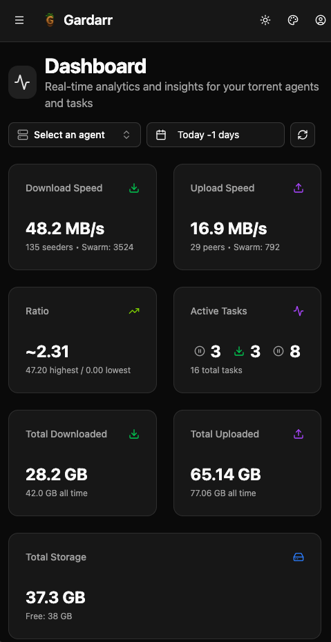
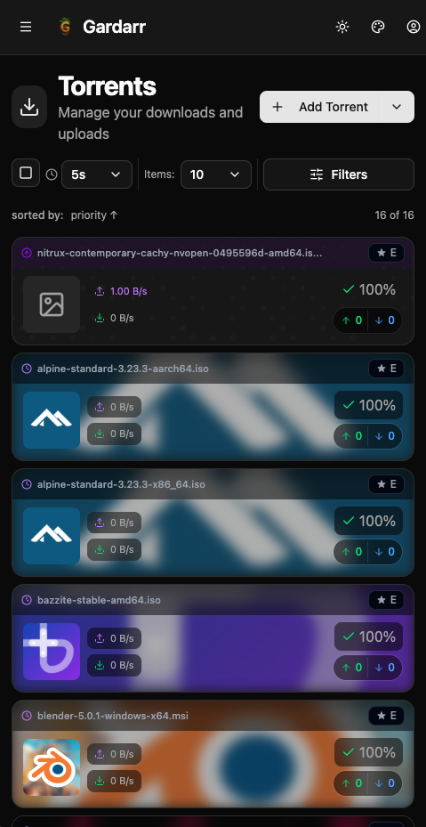
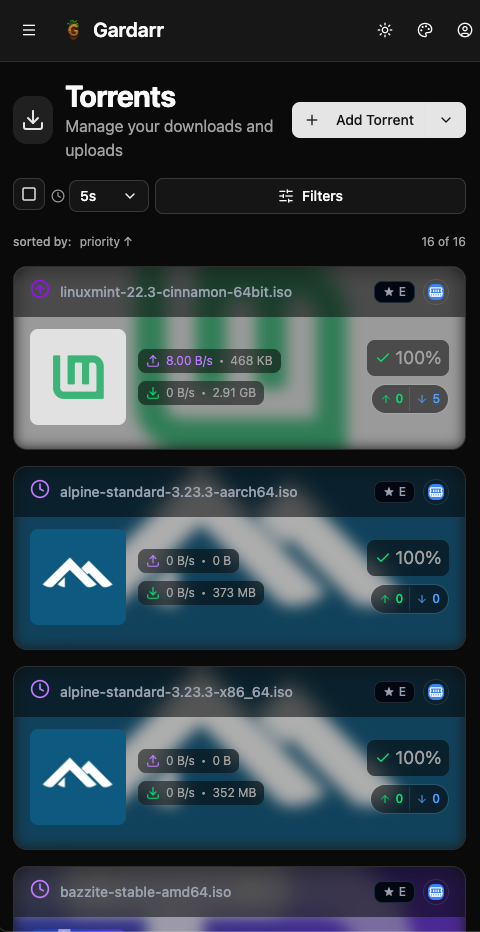
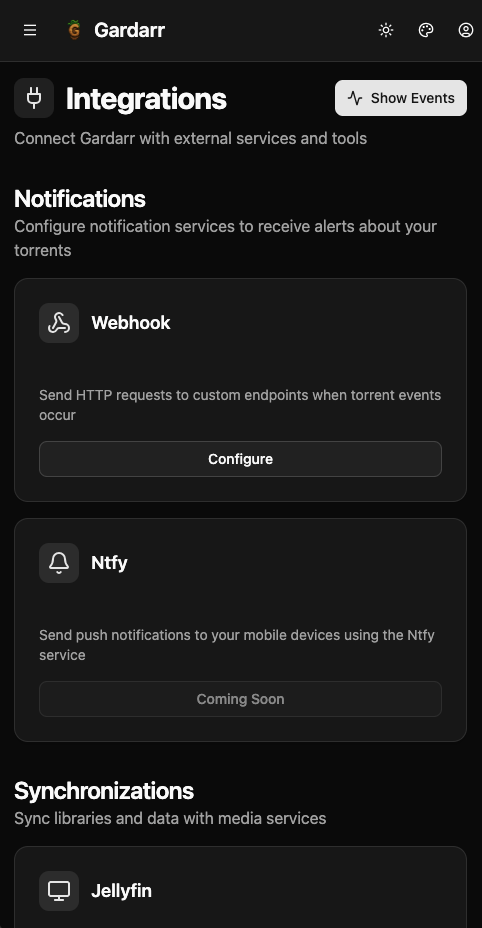
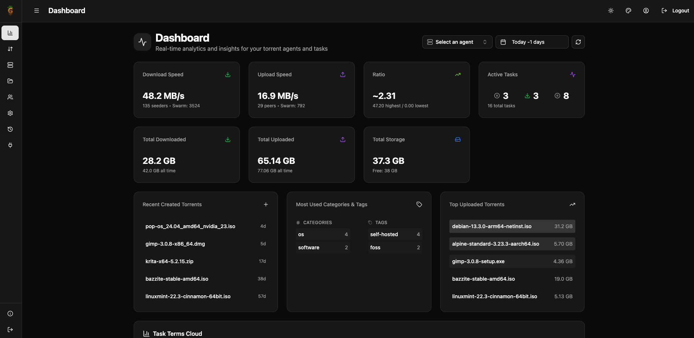
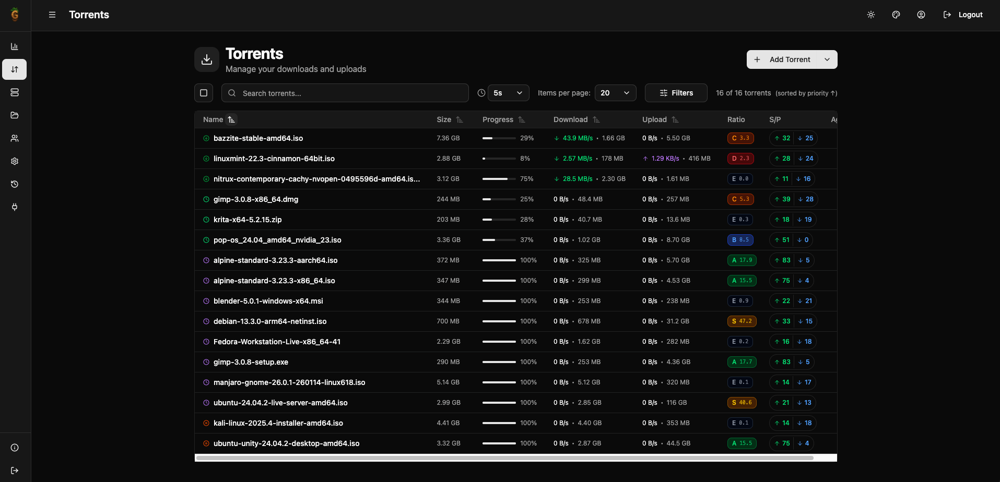
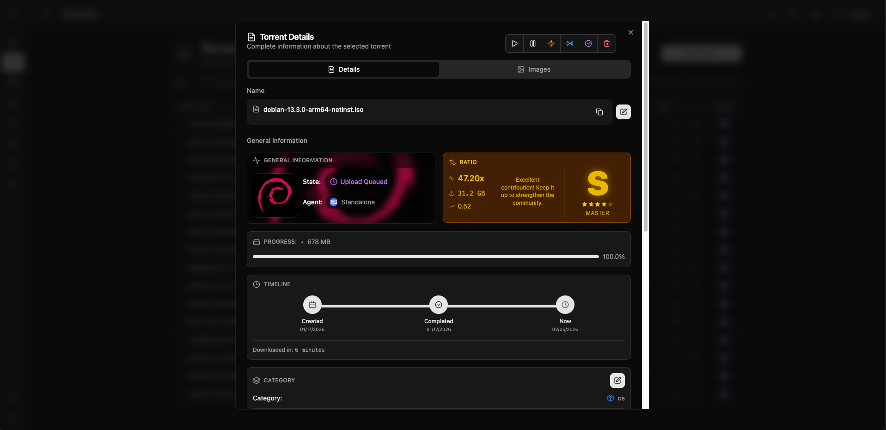
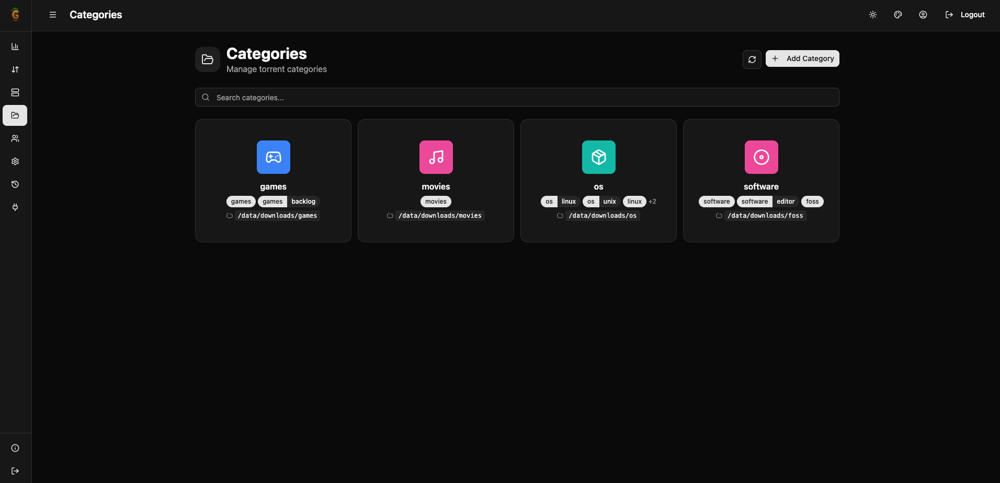
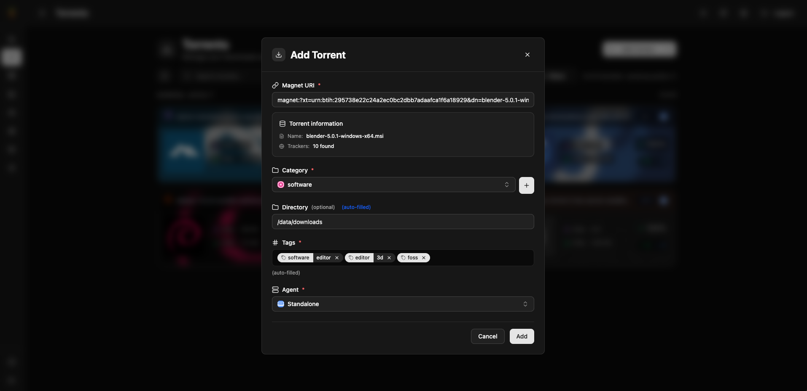

# Gardarr

<p align="center">
  
</p>

<p align="center">
  
  
  
  
  
  <br />
  <a href="https://sonarcloud.io/summary/new_code?id=jfxdev_gardarr"></a>
  <a href="https://sonarcloud.io/summary/new_code?id=jfxdev_gardarr"></a>
  <a href="https://sonarcloud.io/summary/new_code?id=jfxdev_gardarr"></a>
  <a href="https://sonarcloud.io/summary/new_code?id=jfxdev_gardarr"></a>
  <a href="https://sonarcloud.io/summary/new_code?id=jfxdev_gardarr"></a>
  <a href="https://sonarcloud.io/summary/new_code?id=jfxdev_gardarr"></a>
  <a href="https://sonarcloud.io/summary/new_code?id=jfxdev_gardarr"></a>
</p>

Gardarr is a **modern, lightweight management and analytics platform for qBittorrent**, built with performance and user experience in mind. It provides a centralized interface to monitor and control multiple torrent clients, offering advanced insights and a mobile-first design.

**Source-available** project licensed under BSL 1.1, designed to be self-hosted by the community with clean and maintainable code. **Transitions to Apache 2.0 on February 2, 2029**.

## 📸 Screenshots

### 📱 Mobile Experience

<table>
  <tr>
    <td align="center" width="50%">
      <br />
      <em>Dashboard with real-time analytics: speeds, ratio, storage, and active tasks</em>
    </td>
    <td align="center" width="50%">
      <br />
      <em>Compact view optimized for quick browsing on smaller screens</em>
    </td>
  </tr>
  <tr>
    <td align="center" width="50%">
      <br />
      <em>Torrents list with card view featuring cover art and ratio grades</em>
    </td>
    <td align="center" width="50%">
      <br />
      <em>Integrations page for webhooks, notifications, and external services</em>
    </td>
  </tr>
</table>

### 🖥️ Desktop Experience

<table>
  <tr>
    <td align="center">
      <br />
      <em>Full dashboard with analytics widgets, recent torrents, categories, and top uploads</em>
    </td>
  </tr>
  <tr>
    <td align="center">
      <br />
      <em>Table view with sortable columns, color-coded ratio grades (E to S++), and batch actions</em>
    </td>
  </tr>
  <tr>
    <td align="center">
      <br />
      <em>Detailed torrent view with progress timeline, ratio grading system, and custom cover art</em>
    </td>
  </tr>
  <tr>
    <td align="center">
      <br />
      <em>Category management with custom icons, colors, default directories, and auto-tags</em>
    </td>
  </tr>
  <tr>
    <td align="center">
      <br />
      <em>Add torrent modal with magnet URI parsing, auto-filled categories and tags</em>
    </td>
  </tr>
</table>

## 📑 Table of Contents

- [📸 Screenshots](#-screenshots)
- [✨ Key Features](#-key-features)
- [📋 Requirements](#-requirements)
- [🚀 Getting Started](#-getting-started)
  - [Standalone Mode](#-standalone-mode)
  - [Distributed Agent Mode](#-distributed-agent-mode)
- [🏗️ Architecture](#-architecture)
- [🏆 Ratio Grading System](#-ratio-grading-system)
- [🔌 Integrations & Events](#-integrations--events)
- [📊 Metrics & Analytics](#-metrics--analytics)
- [🎨 Customization](#-customization)
  - [Theme Customization](#theme-customization)
  - [Custom Cover Art & Metadata](#custom-cover-art--metadata)
  - [Categories](#categories)
  - [Tags & Composite Tags](#tags--composite-tags)
- [🛠️ Technology Stack](#-technology-stack)
- [⚙️ Configuration](#-configuration)
- [🛠️ Development](#-development)
- [📋 Roadmap](#-roadmap)
- [📄 License](#-license)

## ✨ Key Features

- **🔌 Multi-Agent Management**: Centralized dashboard to manage multiple qBittorrent instances across different servers.
- **⚡ Torrent Control**: Full control to add, pause, resume, delete, and prioritize torrents.
- **📊 Advanced Analytics**:
  - Real-time download/upload speed monitoring.
  - Historical data analysis.
  - **Ratio Grading**: Gamification system (E to S++) for ratio tracking.
- **📝 Event System**: Comprehensive event tracking for state changes, completions, and errors, persisted in the database.
- **🔐 Secure Authentication**: 
  - Argon2id password hashing.
  - HTTP-only secure cookies for session management.
  - Role-based access control (RBAC).
- **🏷️ Organization**: Smart category management with advanced tagging system supporting composite tags.
- **📱 Mobile-First**: Responsive UI designed for seamless usage on smartphones and tablets.
- **🐳 Docker Native**: Built for containerized environments with support for Docker secrets.

### 🌟 For Seedboxes

Essential infrastructure for seedbox operators managing single or multiple servers:
- **Unified Control**: Manage multiple seedboxes across different providers from one dashboard
- **Ratio Optimization**: Track and maintain healthy ratios for private trackers with visual grading
- **Cost Efficiency**: Monitor storage, bandwidth, and performance to maximize ROI
- **Bulk Operations**: Handle hundreds of torrents efficiently with batch actions and smart organization
- **Mobile Management**: Control your seedbox fleet on-the-go with responsive mobile interface

## 📋 Requirements

- **Docker** and **Docker Compose**
- **qBittorrent** v4.1+ (Web UI enabled)
- **Resources**: <100MB RAM typical usage

## 🚀 Getting Started

### 🖥️ Standalone Mode
The easiest way to get started. Manages a single qBittorrent instance.

```bash
# Copy the standalone example
cp examples/standalone/docker-compose.yml docker-compose.yml

# Configure credentials
echo "QBITTORRENT_URL=http://your-qbittorrent:8080" >> .env
echo "QBITTORRENT_USERNAME=your_username" >> .env
echo "QBITTORRENT_PASSWORD=your_password" >> .env

# Start Gardarr
docker-compose up -d
```
Access the dashboard at `http://localhost:3200`.

### 🔌 Distributed Agent Mode
For managing multiple instances.

1. **Generate an Agent Secret**:
   
   The `AGENT_SECRET` is used to secure communication between the main service and remote agents. Generate a secure random key using one of these methods:

   **Option 1: Using OpenSSL**
   ```bash
   openssl rand -hex 32
   ```

   **Option 2: Using Docker**
   ```bash
   docker run --rm ghcr.io/jfxdev/gardarr:latest generate key
   ```

   Copy the generated key and add it to your `.env` file:
   ```bash
   AGENT_SECRET=your_generated_secret_here
   ```

2. **Deploy the Main Service**:
   ```bash
   cp examples/default/docker-compose.yml docker-compose.yml
   docker-compose up -d
   ```

3. **Register Agents**:
   - Go to the UI → Settings → Agents.
   - Generate a new Agent Key.
   - Deploy a Gardarr Agent container on your remote server using the generated key.

## 🏗️ Architecture

Gardarr is designed with flexibility in mind, offering two primary operational modes:

### 1. Standalone Mode (Single Server)
Ideal for home users with a single media server. The application runs as a single process containing both the **Management Service** and an **Embedded Agent**.
- **Simplicity**: One container to deploy.
- **Efficiency**: Direct communication with local qBittorrent.

### 2. Distributed Mode (Multi-Server)
Designed for power users with multiple seedboxes or servers.
- **Central Service**: The main web application and database.
- **Remote Agents**: Lightweight binaries deployed alongside each qBittorrent instance that communicate securely with the Central Service.

## 🏆 Ratio Grading System

Gardarr features an intelligent **gamification system** for torrent sharing, encouraging healthy seeding behavior and community contribution. The system evaluates your share ratio and assigns grades from **E** (beginner) to **S++** (legendary), with color-coded badges, star ratings, and motivational messages.

### Benefits

- **Gamification**: Makes seeding fun and rewarding
- **Visual motivation**: Clear progress indicators encourage better ratios
- **Community health**: Promotes sustainable sharing practices
- **Achievement tracking**: Celebrate milestones as you climb the grades

## 🔌 Integrations & Events

The platform features a robust event-driven architecture to keep you connected.

### Event System

Automatically tracks and persists torrent lifecycle events (state changes, additions, removals, completions) with configurable retention via `EVENT_RETENTION_DAYS`.

**Features:**
- Real-time statistics and filtering by event type
- Search by torrent name or hash with pagination
- Visual indicators with color-coded badges and timestamps

### Event History Page

A comprehensive interface to monitor all torrent activity with event types: `state_change`, `added`, `removed`, and `completed`.

### Webhooks

Connect to external services (Discord, Slack, n8n, Home Assistant) with multiple endpoints, event filtering, and delivery logging.

## 📊 Metrics & Analytics

Comprehensive monitoring for torrent performance and agent health.

- **Torrent Metrics**: Network statistics, lifetime timeline, progress tracking, and file management
- **Agent Metrics**: Real-time speeds, storage usage, ratio statistics, activity analytics, and multi-agent aggregation

## 🎨 Customization

Personalize your library with rich metadata and visual options.

### Themes

- **Dark & Light modes** with persistent preferences
- **14 pre-built color palettes** (Default, Aura, Sunset, Ocean, Forest, Cyberpunk, and more)
- **3 custom palette slots** with 4-color system (Primary, Secondary, Accent, Muted)

### Cover Art & Metadata

Upload custom images (JPEG, PNG, GIF, WEBP up to 10MB) with positioning and opacity controls. Add descriptions and notes to torrents.

### Categories

Organize torrents with pre-configured categories featuring custom icons (16 options), colors (10 options), default directories, and default tags. Configure once, apply everywhere.

### Tags

Simple tags (`movies`, `music`) and composite tags using `::` separator for hierarchical organization (`genre::action`, `quality::4k`, `year::2024`).

## 🛠️ Technology Stack

### Backend
- **Language**: Go 1.25+
- **Framework**: Gin Web Framework
- **Database**: SQLite (default) or PostgreSQL (via GORM)
- **Authentication**: Argon2id + Secure Sessions
- **Config**: Viper (Environment variables & file-based secrets)

### Frontend
- **Framework**: React 19 + Vite
- **Styling**: TailwindCSS 4
- **Charts**: Recharts
- **State/Data**: React Query / Context API
- **Icons**: Lucide React

## ⚙️ Configuration

Gardarr is configured via environment variables. Create a `.env` file in the root directory. All variables support Docker secrets using the `_FILE` suffix.

### Application

| Variable | Description | Default |
|----------|-------------|---------|
| `APP_PORT` | Port for the web interface | `3200` |
| `APP_URL` | Public URL (CORS, cookies). Origin-only, no trailing slash | `http://localhost:3200` |
| `APP_MODE` | Set to `standalone` to enable embedded agent | - |
| `GIN_MODE` | `debug` or `release` (enables HSTS) | `release` |
| `LOG_LEVEL` | Log level: `DEBUG`, `INFO`, `WARN`, `ERROR` | `INFO` |

### Database

| Variable | Description | Default |
|----------|-------------|---------|
| `DATABASE_DRIVER` | Database driver: `sqlite` or `postgres` | `sqlite` |
| `DATABASE_FILE_PATH` | SQLite file path | `/data/gardarr_database.db` |
| `DATABASE_HOST` | PostgreSQL host | `localhost` |
| `DATABASE_PORT` | PostgreSQL port | `5432` |
| `DATABASE_USERNAME` | PostgreSQL username | `gardarr` |
| `DATABASE_PASSWORD` | PostgreSQL password | - |
| `DATABASE_NAME` | PostgreSQL database name | `gardarr_database` |
| `DATABASE_SSL_MODE` | PostgreSQL SSL mode | `disable` |
| `DATABASE_MAX_IDLE_CONNS` | Max idle connections | `10` |
| `DATABASE_MAX_OPEN_CONNS` | Max open connections | `100` |
| `DATABASE_CONN_MAX_LIFETIME` | Connection max lifetime | `1h` |

### Security

| Variable | Description | Default |
|----------|-------------|---------|
| `ENCRYPTION_KEY` | Key for encrypting sensitive data (agent tokens) | - |
| `CUSTOM_CSP` | Custom Content Security Policy override | Built-in CSP |

### Agent (Standalone Mode)

| Variable | Description | Default |
|----------|-------------|---------|
| `AGENT_PORT` | Port for the embedded agent service | `3100` |
| `AGENT_SECRET` | Secret key for agent authentication | Auto-generated |
| `AGENT_TIMEOUT_SECONDS` | Timeout for agent communication | `3` |

### qBittorrent (Standalone Mode)

| Variable | Description | Default |
|----------|-------------|---------|
| `QBITTORRENT_URL` | Base URL of qBittorrent Web UI | - |
| `QBITTORRENT_USERNAME` | qBittorrent username | - |
| `QBITTORRENT_PASSWORD` | qBittorrent password | - |
| `QBITTORRENT_REQUEST_TIMEOUT_SECONDS` | Request timeout | `3` |
| `QBITTORRENT_MAX_RETRIES` | Max retries on failure | `0` |
| `QBITTORRENT_RETRY_BACKOFF` | Retry backoff (seconds) | `1` |

### Statistics

| Variable | Description | Default |
|----------|-------------|---------|
| `STATISTICS_ENABLED` | Enable statistics collection | `true` |
| `STATISTICS_DIR` | Directory for statistics data | `/data/statistics` |
| `STATISTICS_INTERVAL` | Polling interval | `30s` |
| `STATISTICS_RETENTION_DAYS` | Days to retain (0 = forever) | `0` |
| `STATISTICS_PURGE_INTERVAL` | Purge check interval | `30m` |

### Events

| Variable | Description | Default |
|----------|-------------|---------|
| `EVENT_RETENTION_DAYS` | Days to keep event history | `7` |

For detailed documentation, see [backend/docs/ENVIRONMENT_VARIABLES.md](backend/docs/ENVIRONMENT_VARIABLES.md).

## 🛠️ Development

We welcome contributions! Please see [docs/DEVELOPMENT.md](docs/DEVELOPMENT.md) for detailed setup instructions.

```bash
# Quick dev start
git clone https://github.com/jfxdev/gardarr.git
cd gardarr
make dev
```

## 📋 Roadmap

- [ ] **Integrations Page**: Support for external integrations (Jellyfin, Ntfy, etc.).
- [ ] **Smart Speed Limits**: Schedule-based and adaptive speed limits.
- [ ] **OIDC Authentication**: SSO support.
- [ ] **Cross-Host Transfer**: SCP transfer between agents.

## 📄 License

This project is licensed under the **Business Source License 1.1 (BSL 1.1)**.

### License Summary

| Parameter | Value |
|-----------|-------|
| **License** | Business Source License 1.1 |
| **Licensor** | Gardarr Contributors |
| **Effective Date** | February 2, 2026 |
| **Change Date** | February 2, 2029 |
| **Change License** | Apache License 2.0 |

### What You Can Do ✅

- **Self-host** Gardarr for personal, business, or educational purposes
- **Modify** the source code to fit your needs
- **Create derivative works** based on Gardarr
- **Distribute** the software to others
- **Contribute** to the project through pull requests and community engagement
- **Use commercially** as part of internal infrastructure
- **Study** and learn from the source code

### What Is Restricted ❌

- Offering Gardarr or substantially similar functionality as a **commercial hosted service** or **SaaS product** that directly competes with official Gardarr offerings

### License Transition Timeline

```
┌─────────────────────────────────────────────────────────────────────────────┐
│                           LICENSE TIMELINE                                   │
├─────────────────────────────────────────────────────────────────────────────┤
│                                                                             │
│  2026-02-02                              2029-02-02                         │
│      │                                       │                              │
│      ▼                                       ▼                              │
│  ════════════════════════════════════════════════════════════════════════   │
│  │           BSL 1.1 Period                 │     Apache 2.0              │ │
│  │   (Source Available License)             │    (Fully Open Source)      │ │
│  ════════════════════════════════════════════════════════════════════════   │
│                                                                             │
│  ● Self-hosting: ALLOWED                    ● All commercial use: ALLOWED  │
│  ● Modifications: ALLOWED                   ● No restrictions              │
│  ● Contributions: ALLOWED                   ● Permissive license           │
│  ● Competing SaaS: RESTRICTED               ● Full open source             │
│                                                                             │
└─────────────────────────────────────────────────────────────────────────────┘
```

### Why BSL 1.1?

The Business Source License 1.1 allows us to:

1. **Protect the project** from large cloud providers offering Gardarr as a competing service without contributing back
2. **Maintain open development** where anyone can view, modify, and contribute to the code
3. **Support self-hosters** who can freely use Gardarr for any personal or business purpose
4. **Guarantee open-source conversion** - the code will automatically become Apache 2.0 licensed

### Frequently Asked Questions

<details>
<summary><strong>Can I use Gardarr in my company?</strong></summary>

**Yes!** Self-hosting Gardarr for internal company use is explicitly allowed. The restriction only applies to offering Gardarr as a competing commercial service to third parties.
</details>

<details>
<summary><strong>Can I fork and modify Gardarr?</strong></summary>

**Yes!** You can fork, modify, and even distribute your modifications. Your fork must comply with the BSL 1.1 terms until the Change Date (February 2, 2029).
</details>

<details>
<summary><strong>When will Gardarr become fully open source?</strong></summary>

On **February 2, 2029**, this version automatically converts to the **Apache License 2.0**, a permissive open-source license with no restrictions on commercial use.
</details>

<details>
<summary><strong>Can I contribute to Gardarr?</strong></summary>

**Absolutely!** Contributions are welcome. All contributions are subject to this license and will also convert to Apache 2.0 on the Change Date.
</details>

<details>
<summary><strong>Is BSL 1.1 an open-source license?</strong></summary>

BSL 1.1 is a "source-available" license, not technically OSI-approved open source. However, it provides most of the freedoms of open source and **guarantees** automatic conversion to a true open-source license (Apache 2.0) on the Change Date.
</details>

### Full License Text

See the [LICENSE](LICENSE) file for the complete license terms.

### Contact

For commercial licensing inquiries, please contact the Gardarr maintainers through the project's official channels.
