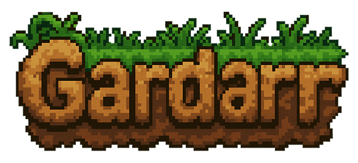

# Gardarr

<p align="center">
  
</p>

<p align="center">
  
  
  
  
  <br />
  <a href="https://sonarcloud.io/summary/new_code?id=jfxdev_gardarr"></a>
  <a href="https://sonarcloud.io/summary/new_code?id=jfxdev_gardarr"></a>
  <a href="https://sonarcloud.io/summary/new_code?id=jfxdev_gardarr"></a>
  <a href="https://sonarcloud.io/summary/new_code?id=jfxdev_gardarr"></a>
  <a href="https://sonarcloud.io/summary/new_code?id=jfxdev_gardarr"></a>
  <a href="https://sonarcloud.io/summary/new_code?id=jfxdev_gardarr"></a>
  <a href="https://sonarcloud.io/summary/new_code?id=jfxdev_gardarr"></a>
</p>

Gardarr is a **modern, lightweight management and analytics platform for qBittorrent**, built with performance and user experience in mind. It provides a centralized interface to monitor and control multiple torrent clients, offering advanced insights and a mobile-first design.

**Fully open-source** project licensed under GPL-3.0, designed to be self-hosted by the community with clean and maintainable code.

## 📑 Table of Contents

- [✨ Key Features](#key-features)
- [🏗️ Architecture](#architecture)
- [🎨 Customization](#customization)
- [🔌 Integrations & Events](#integrations--events)
- [🛠️ Technology Stack](#technology-stack)
- [📋 Requirements](#requirements)
- [🚀 Getting Started](#getting-started)
  - [Standalone Mode](#standalone-mode)
  - [Distributed Agent Mode](#distributed-agent-mode)
- [⚙️ Configuration](#configuration)
- [🛠️ Development](#development)
- [📋 Roadmap](#roadmap)

## ✨ Key Features

- **🔌 Multi-Agent Management**: Centralized dashboard to manage multiple qBittorrent instances across different servers.
- **⚡ Torrent Control**: Full control to add, pause, resume, delete, and prioritize torrents.
- **📊 Advanced Analytics**:
  - Real-time download/upload speed monitoring.
  - Historical data analysis.
  - **Ratio Grading**: Intelligent "School Grade" system (E to S++) for ratio tracking.
- **📝 Event System**: Comprehensive event tracking for state changes, completions, and errors, persisted in the database.
- **🔐 Secure Authentication**: 
  - Argon2id password hashing.
  - HTTP-only secure cookies for session management.
  - Role-based access control (RBAC).
- **🏷️ Organization**: Smart category management and tagging system.
- **📱 Mobile-First**: Responsive UI designed for seamless usage on smartphones and tablets.
- **🐳 Docker Native**: Built for containerized environments with support for Docker secrets.

## 🏗️ Architecture

Gardarr is designed with flexibility in mind, offering two primary operational modes:

### 1. Standalone Mode (Single Server)
Ideal for home users with a single media server. The application runs as a single process containing both the **Management Service** and an **Embedded Agent**.
- **Simplicity**: One container to deploy.
- **Efficiency**: Direct communication with local qBittorrent.

### 2. Distributed Mode (Multi-Server)
Designed for power users with multiple seedboxes or servers.
- **Central Service**: The main web application and database.
- **Remote Agents**: Lightweight binaries deployed alongside each qBittorrent instance that communicate securely with the Central Service.

## 🎨 Customization

Gardarr allows you to personalize your library with rich metadata and visual options:

- **Custom Cover Art**: Upload custom images (JPEG, PNG, GIF, WEBP) for any torrent up to 10MB.
- **Visual Fine-Tuning**: 
  - **Positioning**: Adjust the vertical position of cover images.
  - **Opacity**: Control image transparency (15-85%) for better text readability.
- **Rich Metadata**: Add custom descriptions and notes to your torrents.
- **Organization**: Advanced tagging and category management system.

## 🔌 Integrations & Events

The platform features a robust event-driven architecture to keep you connected:

### Event System
Automatically tracks and persists lifecycle events in the database:
- **State Changes**: Monitor transitions (e.g., Downloading → Seeding, Paused → Resumed).
- **Lifecycle**: Track when torrents are added, removed, or completed.
- **Retention**: Configurable history retention (Default: 30 days) via `EVENT_RETENTION_DAYS`.

### Webhooks
Connect Gardarr to external services like Discord, Slack, or automation tools (n8n, Home Assistant):
- **Flexible Targets**: Configure multiple webhook endpoints.
- **Event Filtering**: Select exactly which events trigger notifications for each webhook.
- **Security**: Support for SSL verification skipping (optional) and secure timeouts.
- **History**: Logs webhook delivery attempts for debugging.

## 🛠️ Technology Stack

### Backend
- **Language**: Go 1.25+
- **Framework**: Gin Web Framework
- **Database**: SQLite (default) or PostgreSQL (via GORM)
- **Authentication**: Argon2id + Secure Sessions
- **Config**: Viper (Environment variables & file-based secrets)

### Frontend
- **Framework**: React 19 + Vite
- **Styling**: TailwindCSS 4
- **Charts**: Recharts
- **State/Data**: React Query / Context API
- **Icons**: Lucide React

## 📋 Requirements

- **Docker** and **Docker Compose**
- **qBittorrent** v4.1+ (Web UI enabled)
- **Resources**: <100MB RAM typical usage

## 🚀 Getting Started

### 🖥️ Standalone Mode
The easiest way to get started. Manages a single qBittorrent instance.

```bash
# Copy the standalone example
cp examples/standalone/docker-compose.yml docker-compose.yml

# Configure credentials
echo "QBITTORRENT_BASEURL=http://your-qbittorrent:8080" >> .env
echo "QBITTORRENT_USERNAME=your_username" >> .env
echo "QBITTORRENT_PASSWORD=your_password" >> .env

# Start Gardarr
docker-compose up -d
```
Access the dashboard at `http://localhost:3000`.

### 🔌 Distributed Agent Mode
For managing multiple instances.

1. **Deploy the Main Service**:
   ```bash
   cp examples/default/docker-compose.yml docker-compose.yml
   docker-compose up -d
   ```

2. **Register Agents**:
   - Go to the UI → Settings → Agents.
   - Generate a new Agent Key.
   - Deploy a Gardarr Agent container on your remote server using the generated key.

## ⚙️ Configuration

Gardarr is configured via environment variables. Create a `.env` file in the root directory.

| Variable | Description | Default |
|----------|-------------|---------|
| `APP_PORT` | Port for the web interface | `3000` |
| `APP_URL` | Public URL of Gardarr (used for CORS and links) | `http://localhost:3000` |
| `GIN_MODE` | `debug` or `release` | `debug` |
| `APP_MODE` | Set to `standalone` to enable embedded agent | - |
| `DB_TYPE` | Database type (`sqlite` or `postgres`) | `sqlite` |
| `EVENT_RETENTION_DAYS` | Days to keep event history | `30` |
| `STATISTICS_INTERVAL` | Polling interval for stats | `30s` |

### Database Configuration (PostgreSQL)
```bash
DB_TYPE=postgres
POSTGRES_HOST=db
POSTGRES_USER=gardarr
POSTGRES_PASSWORD=securepassword
POSTGRES_DB=gardarr
POSTGRES_PORT=5432
```

For a complete list of environment variables, see [backend/docs/ENVIRONMENT_VARIABLES.md](backend/docs/ENVIRONMENT_VARIABLES.md).

## 🛠️ Development

We welcome contributions! Please see [docs/DEVELOPMENT.md](docs/DEVELOPMENT.md) for detailed setup instructions.

```bash
# Quick dev start
git clone https://github.com/jfxdev/gardarr.git
cd gardarr
make dev
```

## 📋 Roadmap

- [ ] **Integrations Page**: Support for external integrations (Jellyfin, Ntfy, etc.).
- [ ] **Smart Speed Limits**: Schedule-based and adaptive speed limits.
- [ ] **OIDC Authentication**: SSO support.
- [ ] **Cross-Host Transfer**: SCP transfer between agents.

## 📄 License

This project is licensed under the GPL-3.0 License - see the [LICENSE](LICENSE) file for details.
